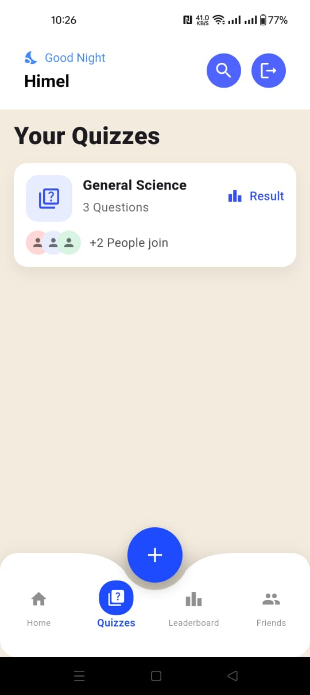
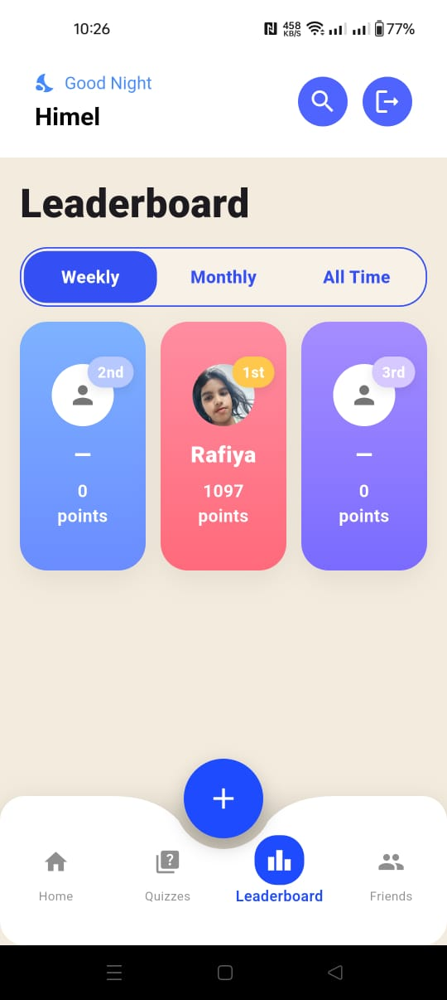

# 📚 Quiz Academy — Flutter App

[](https://flutter.dev)
[](https://dart.dev)
[](https://riverpod.dev)
[](https://pub.dev/packages/go_router)
[](https://supabase.com)
[](#)
[](LICENSE)

Engage your users with quick, shareable quizzes, real‑time leaderboards, and a clean, delightful UI. Quiz Academy is built with **Flutter + Riverpod**, powered by **Supabase**, and navigated with **go_router**.

---

## ✨ Highlights

- Email/password **authentication**
- **Create** quizzes manually or **import from CSV**
- **Share & join** by quiz code (e.g., `Q-452-456`)
- **Search** quiz by code
- **Leaderboard** with **Weekly / Monthly / All‑time** tabs
- **Friends**: find, request, accept
- Modern UI components and **bottom navigation**

---

## 📸 Screenshots

> Place the `screenshots/` folder in your repo root so these links work on GitHub.

  

  

  


---


---

## 🎥 Demo
<p></p>


<video src="./assets/demo.mp4" controls muted playsinline width="420"></video>

> If the player doesn’t render on some GitHub clients, you can **[download the video here](./assets/demo.mp4)**.

## 🧱 Tech Stack

- **Flutter** + **Dart**
- **Riverpod** for state management
- **go_router** for navigation
- **Supabase** for auth, database, and real‑time features

---

## 🚀 Getting Started

### Prerequisites
- Flutter **3.x** and Dart **3.x**
- A Supabase project (obtain **SUPABASE_URL** and **SUPABASE_ANON_KEY**)

### Setup

```bash
# 1) Clone
git clone https://github.com/<your-org>/<your-repo>.git
cd <your-repo>

# 2) Install packages
flutter pub get
```

Create your env/config (choose the style you prefer):

**Option A — Dart constants**
```dart
// lib/core/env.dart
class Env {{
  static const supabaseUrl = 'https://YOUR-PROJECT.supabase.co';
  static const supabaseAnonKey = 'YOUR_SUPABASE_ANON_KEY';
}}
```

**Option B — .env (with flutter_dotenv)**
```
SUPABASE_URL=https://YOUR-PROJECT.supabase.co
SUPABASE_ANON_KEY=YOUR_SUPABASE_ANON_KEY
```

Then initialize Supabase early (e.g., in `main.dart`).

### Run
```bash
flutter run
```

---

## 🧪 CSV Import Format

When importing from CSV, use the following simple structure:

```
question,optionA,optionB,optionC,optionD,correctIndex,timeLimitSec,category
"What is Flutter?",SDK,Framework,Language,IDE,0,30,technology
```

- `correctIndex` is **0‑based** (0..3).  
- Add/omit extra columns as needed by your data model.

---

## 📁 Suggested Folder Structure

```
lib/
  core/
    router/
      app_router.dart
    env.dart
  models/
    question_draft.dart
  providers/
    auth_controller.dart
    profile_completion_provider.dart
  screens/
    home_screen.dart
    login_screen.dart
    register_screen.dart
    leader_board_screen.dart
    quiz_list_screen.dart
    complete_profile_screen.dart
    create_quiz/
      create_quiz_meta_screen.dart
```

---

## 🗺️ Roadmap

- Push notifications for friend requests & quiz events
- Public quiz hub & categories
- Offline mode
- Unit & widget tests

---

## 🤝 Contributing

PRs are welcome!  
If you spot UI/UX tweaks, accessibility fixes, or performance improvements, please open an issue first to discuss the change.

---

## 📝 License

MIT © 2025-10-25 — Quiz Academy
